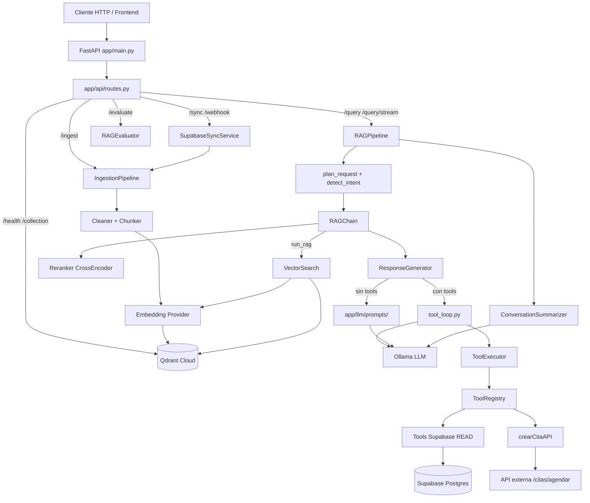

# Arquitectura del Proyecto

## Objetivo

API de **Retrieval-Augmented Generation (RAG)** especializada en **diagnóstico y mecánica automotriz**. Ingiere documentos (PDF/TXT/MD o filas de Supabase), los indexa en **Qdrant Cloud**, y responde consultas en lenguaje natural con un LLM local (**Ollama**). Opcionalmente usa **function calling** (tools) para consultar registros en Supabase y agendar citas vía API externa.

## Arquitectura en capas

Entrada HTTP vía FastAPI:

| Capa | Paquete | Responsabilidad |
| ---- | ------- | --------------- |
| API | `app/api/` | Endpoints HTTP, auth de sync/webhook, schemas de request/response de API |
| Orquestación RAG | `app/rag/` | Pipeline, planning de intent, chain, memoria, tool loop, SSE |
| Prompts | `app/llm/prompts/` | Plantillas de texto enviadas al LLM |
| LLM | `app/llm/` | Proveedor Ollama (Azure GPT stub) |
| Recuperación | `app/retrieval/` | Búsqueda vectorial + reranker CrossEncoder |
| Embeddings | `app/embeddings/` | Sentence Transformers (Azure embeddings stub) |
| Vector store | `app/vectorstore/` | Qdrant (Azure Cosmos stub) |
| Ingesta | `app/ingestion/` | Loaders, limpieza, chunking, sync Supabase |
| Tools | `app/tools/` | Registry, executor, schemas e implementaciones |
| Evaluación | `app/evaluation/` | Métricas heurísticas / benchmark |
| Config | `app/core/config.py` | Settings desde `.env` |

Patrón de providers: `PROVIDER_TYPE=LOCAL` (implementado) o `AZURE` (stubs que lanzan `NotImplementedError`).

## Tecnologías

- **Python 3.11+**, FastAPI, Uvicorn, Pydantic / pydantic-settings
- **Ollama** (LLM + function calling)
- **Sentence Transformers** (`paraphrase-multilingual-MiniLM-L12-v2`, 384d)
- **CrossEncoder** reranker (`BAAI/bge-reranker-v2-m3`)
- **Qdrant Cloud** (HNSW, cosine)
- **Supabase** (cliente Python, service role) — ingesta + tools de lectura
- **httpx** — API de citas (`CITAS_API_BASE_URL`)
- Docker Compose (solo servicio `app`; Ollama en host)

**MCP:** no hay integración MCP en este repositorio. Las “tools” son function calling nativo de Ollama.

## Estructura de carpetas

```
app/
├── main.py                 # FastAPI + lifespan + CORS
├── api/                    # Rutas HTTP, schemas API, auth sync/webhook
├── core/                   # config, providers, supabase, logger, chunks, documents
├── rag/                    # pipeline, chain, intent, context_plan, memory, tool_loop, schemas, sse
├── llm/                    # base, generator, prompts/, ollama client/provider, model_config
├── embeddings/             # base + sentence_transformer (+ azure stub)
├── vectorstore/            # base, indexer, qdrant (+ azure cosmos stub)
├── retrieval/              # search, reranker
├── ingestion/              # pipeline, loaders, processors, supabase_sync
├── tools/                  # registry, executor, schemas, implementations
└── evaluation/             # dataset, metrics, evaluator
scripts/                    # ingest.py, build_index.py, test_query.py
tests/                      # pytest
data/                       # raw, chunks, processed
context/                    # esta documentación técnica
```

## Diagrama de arquitectura



## Ver también

- [flows.md](./flows.md) — flujos de ejecución
- [tools.md](./tools.md) — herramientas
- [integrations.md](./integrations.md) — sistemas externos
