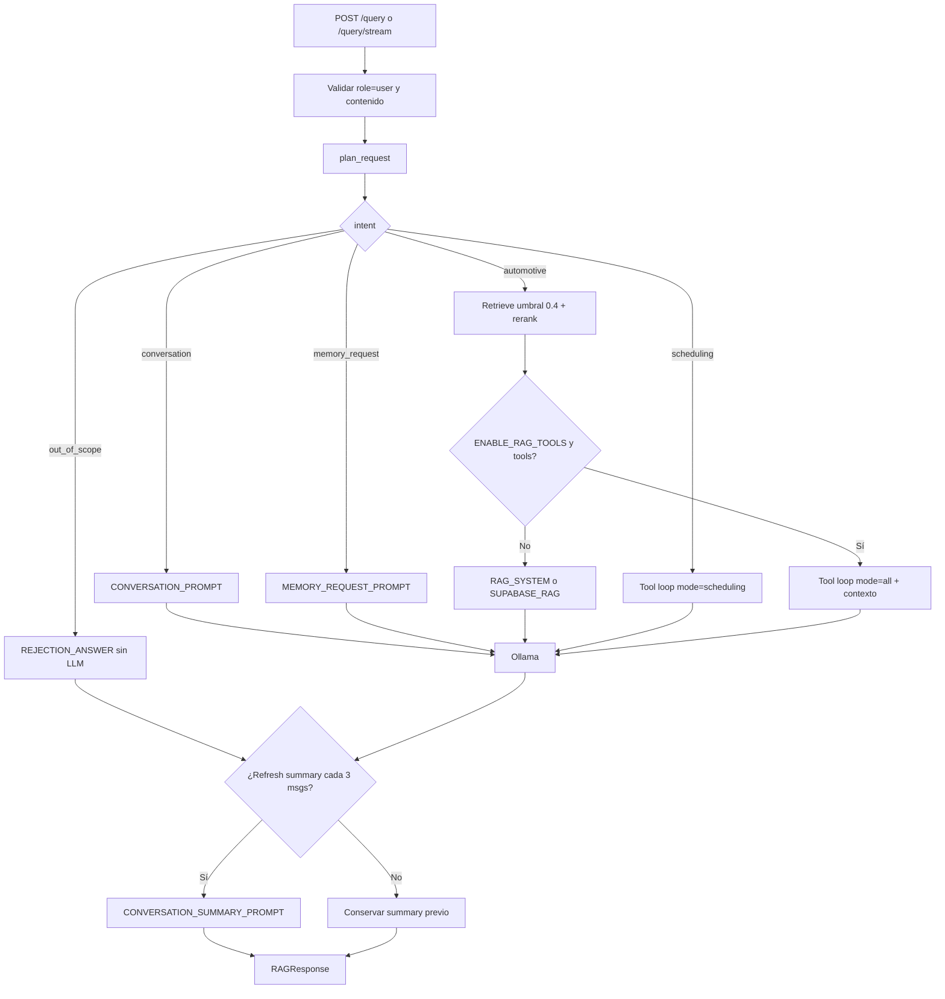
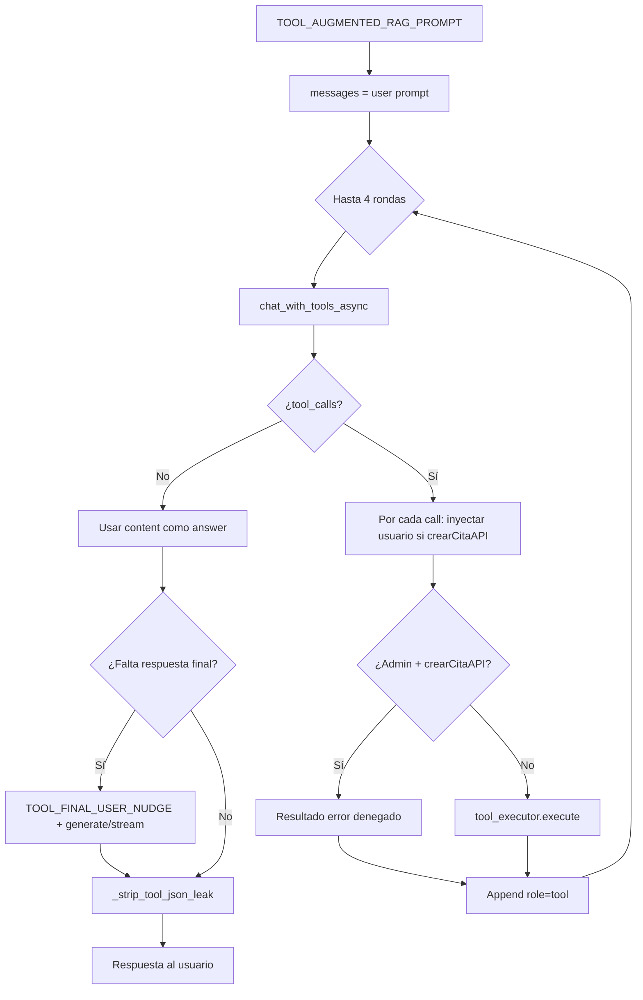

# Flujos de Ejecución

## Arranque (`app/main.py` → lifespan)

1. Valida `PROVIDER_TYPE` ∈ `{LOCAL, AZURE}`.
2. Precarga embeddings (inferencia dummy).
3. Conecta a Qdrant Cloud.
4. Precarga CrossEncoder reranker (warmup).
5. Verifica/calienta Ollama.
6. Llama `register_all_tools()` según `ENABLE_RAG_TOOLS` y configuración Supabase.
7. Expone rutas bajo `/api/v1`.

## Consulta conversacional (`POST /api/v1/query` o `/query/stream`)

1. `create_rag_pipeline()` construye `RAGPipeline`.
2. Valida `message.role == "user"` y contenido no vacío.
3. **`plan_request(request)`** (`app/rag/context_plan.py`):
   - Detecta intent (`detect_intent`).
   - Bloquea palabras prohibidas → fuerza `OUT_OF_SCOPE`.
   - Extrae vehículo/problema; actualiza `WorkingMemory`.
   - Decide `run_rag`, `use_tools`, `tool_mode`, historial y query de retrieval.
4. **`RAGChain.run` / stream**:
   - Si `run_rag`: embed query → Qdrant (umbral 0.4) → rerank opcional → top `max_chunks`.
   - Si no: contexto vacío (sin búsqueda).
5. **`ResponseGenerator`**:
   - Si pregunta sentinel `REJECT_OUT_OF_SCOPE_REQUEST` → respuesta fija (sin LLM).
   - Si `use_tools` y tools activas → **`TOOL_AUGMENTED_RAG_PROMPT`** + tool loop.
   - Si no → prompt según intent (`CONVERSATION` / `MEMORY` / `OUT_OF_SCOPE` / RAG).
6. Opcionalmente refresca **summary** cada 3 mensajes de usuario (`CONVERSATION_SUMMARY_PROMPT`).
7. Devuelve `RAGResponse` (answer, summary, working_memory, sources, metadata).

Detalle del router de intents: [intents.md](./intents.md).  
Detalle de prompts: [prompts/](./prompts/README.md).

## Ingesta

- **Archivos:** `POST /ingest` → `IngestionPipeline` → `VectorIndexer`.
- **Supabase sync:** `POST /sync` (header `X-Sync-Secret`) full/incremental.
- **Webhook:** `POST /webhooks/supabase` (header `X-Webhook-Secret`) solo INSERT.

Pipeline de documentos: loader → cleaner → chunker → embeddings → Qdrant. Los chunks se pueden persistir en `data/chunks/chunks.json`.

## Evaluación

- `POST /evaluate` → `RAGEvaluator` sobre dataset (sin prompts de generación propios más allá del pipeline RAG).

## Diagrama de flujo del sistema (consulta)

## Flujo del agente con tools

**Stream + tools:** las rondas de function calling son **no streaming**; luego se emite la respuesta final en chunks SSE (`token`) y un evento `done`.

Implementación: `app/rag/tool_loop.py`. Catálogo de tools: [tools.md](./tools.md).

## Endpoints principales

| Método | Ruta | Descripción |
| ------ | ---- | ----------- |
| GET | `/api/v1/health` | Estado Ollama + Qdrant |
| POST | `/api/v1/ingest` | Ingesta de archivos |
| POST | `/api/v1/sync` | Sync Supabase |
| POST | `/api/v1/webhooks/supabase` | Webhook INSERT |
| POST | `/api/v1/query` | Consulta RAG |
| POST | `/api/v1/query/stream` | Consulta SSE |
| POST | `/api/v1/evaluate` | Benchmark |
| GET | `/api/v1/collection/info` | Stats de colección |
