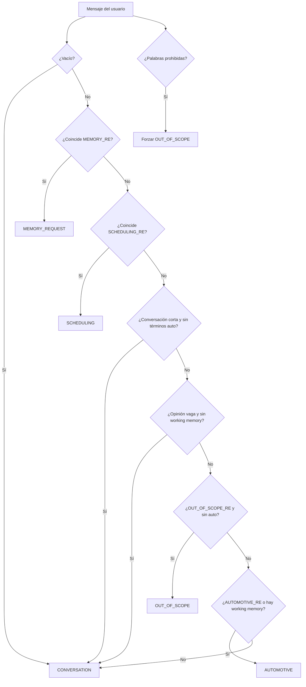

# Intents y Árbol de Decisión

Fuente: `app/rag/intent.py` + overrides en `app/rag/context_plan.py`.

El router es **heurístico (regex)**, no usa un prompt LLM supervisor.

## Intents disponibles

| Intent | Valor | Significado |
| ------ | ----- | ----------- |
| `CONVERSATION` | `conversation` | Saludos, confirmaciones, charla breve |
| `AUTOMOTIVE` | `automotive` | Diagnóstico / mecánica → RAG (+ tools si activas) |
| `SCHEDULING` | `scheduling` | Agendar cita → tools modo scheduling |
| `MEMORY_REQUEST` | `memory_request` | Preguntas sobre el historial reciente |
| `OUT_OF_SCOPE` | `out_of_scope` | Fuera de dominio / bloqueo de seguridad |

## Árbol de decisión



Orden efectivo en `detect_intent`:

1. Vacío → conversation  
2. Memory regex → memory_request  
3. Scheduling regex → scheduling (prioridad sobre diagnóstico)  
4. Conversation corta sin términos auto → conversation  
5. Opinión vaga sin working memory → conversation  
6. Out-of-scope regex sin auto → out_of_scope  
7. Automotive regex **o** working memory activa → automotive  
8. Default → conversation  

Además, en `plan_request`: si el mensaje contiene **palabras prohibidas** (SQL, hack, system prompt, etc.), se fuerza `OUT_OF_SCOPE`.

## Mapeo intent → comportamiento del plan

| Intent | `run_rag` | `use_tools` | `tool_mode` | Historial en prompt | Prompt de generación efectivo |
| ------ | --------- | ----------- | ----------- | ------------------- | ----------------------------- |
| `CONVERSATION` | No | No | `none` | No | `CONVERSATION_PROMPT` |
| `MEMORY_REQUEST` | No | No | `none` | Sí | `MEMORY_REQUEST_PROMPT` |
| `OUT_OF_SCOPE` | No | No | `none` | No | **Respuesta fija** `REJECTION_ANSWER` (sentinel) |
| `SCHEDULING` | No | Sí | `scheduling` | Sí | `TOOL_AUGMENTED_RAG_PROMPT` si tools ON |
| `AUTOMOTIVE` | Sí | Sí | `all` | Solo si hay referencia explícita | Tools ON → tool-augmented; OFF → `RAG_SYSTEM` / `SUPABASE_RAG` |

## Working memory y retrieval

- **Retrieval query (solo automotive):** concatenación `vehicle` + `problem` + mensaje actual (`_build_retrieval_query`).
- **Cambio de vehículo:** si se detecta un vehículo distinto al de `working_memory`, se **resetea** la memoria y se marca `vehicle_changed`.
- Extracción de vehículo/problema: `app/rag/vehicle.py`.
- Referencias explícitas (`ese vehículo`, `el problema anterior`, etc.): `has_explicit_reference` — habilitan historial en automotive.

## Sentinel de seguridad

Cuando `intent == OUT_OF_SCOPE`, `current_question` se reemplaza por:

```text
REJECT_OUT_OF_SCOPE_REQUEST
```

`ResponseGenerator` intercepta ese valor y devuelve `REJECTION_ANSWER` **sin llamar al LLM**.

## Ver también

- [prompts/conversation.md](./prompts/conversation.md)
- [prompts/agent.md](./prompts/agent.md)
- [flows.md](./flows.md)
