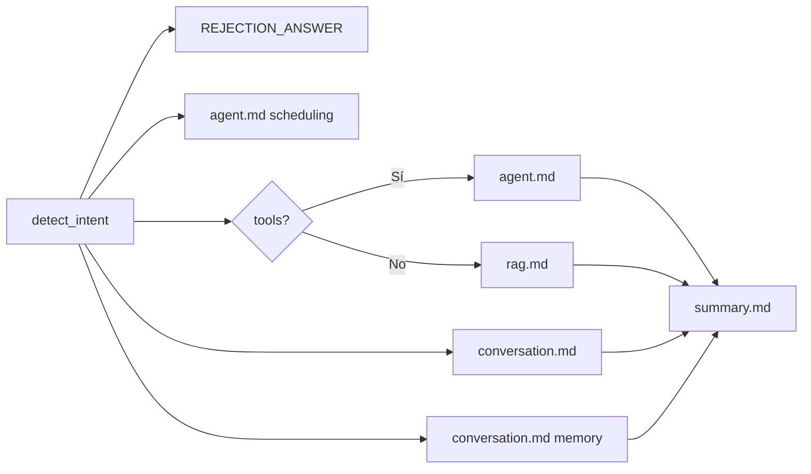

# Documentación de Prompts

Todos los prompts / fragmentos de texto viven en **`app/core/prompts.py`**, salvo las **descripciones de tools** (schemas JSON) y **respuestas estáticas** sin LLM.

## Índice

| Prompt / Fragmento | Archivo código | Doc | Función |
| ------------------ | -------------- | --- | ------- |
| `RAG_SYSTEM_PROMPT` | `app/core/prompts.py` | [rag.md](./rag.md) | RAG sin tools (sin Supabase) |
| `SUPABASE_RAG_PROMPT` | `app/core/prompts.py` | [rag.md](./rag.md) | RAG sin tools (con Supabase) |
| `CONVERSATION_PROMPT` | `app/core/prompts.py` | [conversation.md](./conversation.md) | Charla breve |
| `MEMORY_REQUEST_PROMPT` | `app/core/prompts.py` | [conversation.md](./conversation.md) | Preguntas sobre historial |
| `OUT_OF_SCOPE_PROMPT` | `app/core/prompts.py` | [conversation.md](./conversation.md) | Fuera de dominio (legado; ver nota) |
| `TOOL_AUGMENTED_RAG_PROMPT` | `app/core/prompts.py` | [agent.md](./agent.md) | Generación con function calling |
| `TOOL_MODE_RULES_*` | `app/core/prompts.py` | [agent.md](./agent.md) | Reglas por `tool_mode` |
| `ROLE_RULES_*` | `app/core/prompts.py` | [agent.md](./agent.md) | Reglas por rol |
| `TOOL_FINAL_USER_NUDGE` | `app/core/prompts.py` | [agent.md](./agent.md) | Nudge post-tools |
| `CONVERSATION_SUMMARY_PROMPT` | `app/core/prompts.py` | [summary.md](./summary.md) | Resumen pasivo |
| Schemas de tools | `app/tools/schemas/*.py` | [../tools.md](../tools.md) | Instrucciones de function calling |

## Respuestas fijas (no son prompts LLM)

| Constante | Archivo | Cuándo |
| --------- | ------- | ------ |
| `REJECTION_ANSWER` | `app/llm/generator.py` | Intent fuera de ámbito / palabras prohibidas (sentinel) |
| `ADMIN_SCHEDULING_DENIED` | `app/rag/tool_loop.py` | Admin en modo scheduling |
| `NO_CONTEXT_ANSWER` / `EMPTY_VECTOR_CONTEXT` | `generator.py` / `chain.py` | Contexto vacío pasado al prompt |

## Cómo interactúan los prompts

1. **Router de intent (heurístico, no LLM)** elige qué familia de prompt aplica; no hay un “supervisor prompt”. Ver [../intents.md](../intents.md).
2. **Prompts conversacionales / memoria / out-of-scope** son mutuamente excluyentes respecto a RAG/tools.
3. **RAG documental** (`RAG_SYSTEM` vs `SUPABASE_RAG`) solo aplica cuando no se entra al tool loop.
4. **Tool-augmented** sustituye el prompt RAG efectivo e **inyecta** fragmentos `ROLE_*` + `TOOL_MODE_*`; opcionalmente añade `TOOL_FINAL_USER_NUDGE`.
5. **Summary** corre **después** de la respuesta, con un prompt independiente; no alimenta la generación del turno actual.
6. **Working memory** sí se comparte entre turnos vía request/response y se inyecta en prompts RAG y tools.
7. **Schemas de tools** actúan como micro-instrucciones paralelas al prompt principal en la misma llamada `chat_with_tools`.

## Selección en código

- Sin tools: `ResponseGenerator._build_prompt` (`app/llm/generator.py`)
- Con tools: `_build_tool_prompt` (`app/rag/tool_loop.py`)
- Summary: `ConversationSummarizer` (`app/rag/memory.py`)
